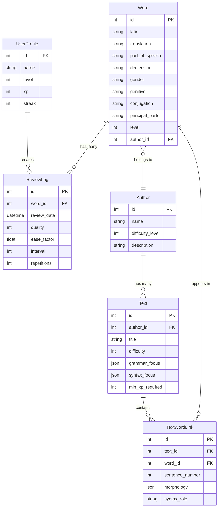
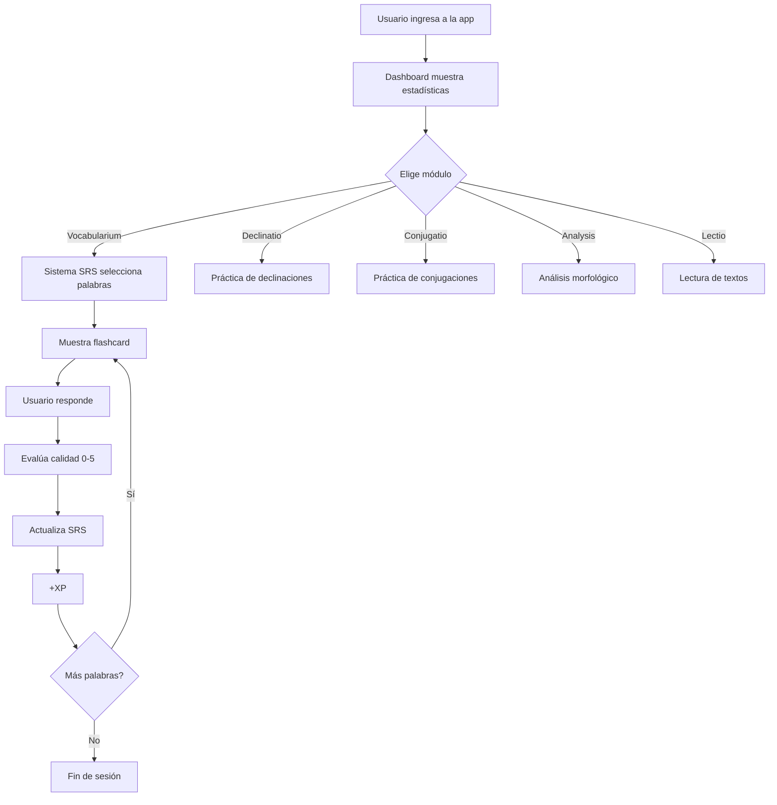
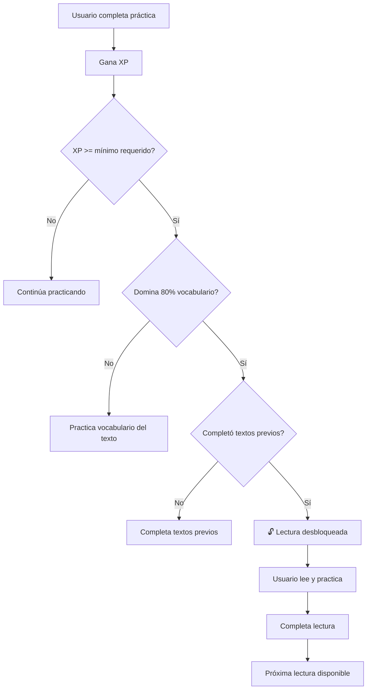

# Arquitectura del Sistema - Lingua Latina Viva

## Visión General
Lingua Latina Viva es una aplicación de aprendizaje de latín clásico que utiliza un enfoque basado en corpus, gamificación y repetición espaciada (SRS) para desarrollar competencias en traducción y comprensión de textos latinos clásicos.

## Principios Fundamentales

### 1. Autenticidad del Corpus
- **Todo** el vocabulario y formas provienen de textos clásicos reales
- No se introducen palabras o construcciones artificiales
- Fuentes principales: Ørberg, Caesar, Cicero, Virgilio, Ovidio, etc.

### 2. Progresión Pedagógica
- Sistema de niveles estricto (1-10)
- Desbloqueo progresivo basado en dominio del vocabulario y XP
- Énfasis en palabras de alta frecuencia
- Priorización de palabras invariables (preposiciones, adverbios, conjunciones)

### 3. Repetición Espaciada (SRS)
- Algoritmo SM-2 adaptado
- Intervalo óptimo basado en calidad de respuesta
- Priorización de palabras frecuentes y fundamentales

### 4. Integración de Competencias
- Morfología (declinaciones y conjugaciones)
- Vocabulario (flashcards con SRS)
- Sintaxis (análisis de formas en contexto)
- Lectura (textos anotados con explicaciones)

## Stack Tecnológico

### Backend
- **Python 3.11+**: Lenguaje principal
- **SQLite**: Base de datos local
- **SQLModel**: ORM para manejo de base de datos
- **SQLAlchemy**: Motor de base de datos

### Frontend
- **Streamlit**: Framework web para UI
- **CSS personalizado**: Estética clásica romana

### Requisitos
- 100% offline y portable
- Sin dependencias de servicios externos
- Base de datos local (SQLite)

## Estructura del Proyecto

```
latin-python/
├── app.py                      # Punto de entrada Streamlit
├── requirements.txt            # Dependencias Python
├── lingua_latina.db           # Base de datos SQLite
│
├── pages/                     # Páginas de Streamlit
│   ├── 01_🏠_Home.py         # Dashboard principal
│   ├── 02_🎴_Vocabularium.py  # Flashcards (SRS)
│   ├── 03_📜_Declinatio.py    # Práctica de declinaciones
│   ├── 04_⚔️_Conjugatio.py    # Práctica de conjugaciones
│   ├── 05_🔍_Analysis.py      # Análisis morfológico
│   ├── 06_📖_Lectio.py        # Lecturas
│   └── 07_⚙️_Admin.py         # Administración
│
├── database/                  # Capa de datos
│   ├── models.py             # Modelos SQLModel
│   ├── connection.py         # Gestión de sesiones
│   └── migrations/           # (Futuro) Migraciones
│
├── utils/                    # Utilidades
│   ├── latin_logic.py       # Lógica de morfología latina
│   ├── srs.py               # Algoritmo SRS (SM-2)
│   └── validators.py        # (Futuro) Validaciones
│
├── data/                     # Archivos de datos
│   ├── vocabulary/          # CSVs de vocabulario por nivel
│   ├── texts/               # Textos latinos anotados
│   └── corpus/              # (Futuro) Corpus por autor
│
├── assets/                   # Recursos estáticos
│   └── style.css            # Estilos personalizados
│
└── docs/                     # Documentación
    ├── ARCHITECTURE.md      # Este archivo
    ├── CONTRIBUTING.md      # Guía de contribución
    ├── AI_PROMPTS.md        # Prompts para IA
    └── enhancement_plan.md  # Plan de mejoras futuras
```

## Modelos de Datos

### Diagrama de Relaciones


### Modelos Principales

#### Word
Representa una palabra latina con toda su información morfológica.

```python
class Word(SQLModel, table=True):
    id: Optional[int] = Field(default=None, primary_key=True)
    latin: str                    # Forma canónica
    translation: str              # Traducción al español
    part_of_speech: str          # noun, verb, adjective, etc.
    declension: Optional[str]    # 1, 2, 3, 4, 5
    gender: Optional[str]        # m, f, n
    genitive: Optional[str]      # Genitivo singular (para sustantivos)
    conjugation: Optional[str]   # 1, 2, 3, 4
    principal_parts: Optional[str] # Partes principales (verbos)
    level: int = 1               # Nivel de dificultad (1-10)
    frequency_rank: Optional[int] # Ranking de frecuencia
    is_invariable: bool = False  # Preposiciones, adverbios, etc.
```

#### ReviewLog
Registra cada revisión de una palabra en el sistema SRS.

```python
class ReviewLog(SQLModel, table=True):
    id: Optional[int] = Field(default=None, primary_key=True)
    word_id: int = Field(foreign_key="word.id")
    review_date: datetime = Field(default_factory=datetime.now)
    quality: int                 # 0-5 (algoritmo SM-2)
    ease_factor: float           # Factor de facilidad
    interval: int                # Días hasta próxima revisión
    repetitions: int             # Número de repeticiones exitosas
```

#### UserProfile
Perfil del usuario con estadísticas y progreso.

```python
class UserProfile(SQLModel, table=True):
    id: Optional[int] = Field(default=None, primary_key=True)
    name: str
    level: int = 1               # Nivel actual (1-10)
    xp: int = 0                  # Puntos de experiencia
    streak: int = 0              # Días consecutivos de práctica
    last_activity: Optional[datetime]
```

## Componentes Principales

### 1. LatinMorphology (`utils/latin_logic.py`)
Responsable de generar todas las formas de una palabra.

**Métodos principales:**
- `decline_noun(word, declension, gender, genitive)`: Genera las 12 formas de un sustantivo
- `conjugate_verb(word, conjugation, principal_parts)`: Genera formas verbales
- `normalize_latin(text)`: Elimina macrones para comparación

**Características:**
- Manejo de 5 declinaciones
- Soporte para géneros masculino, femenino, neutro
- 3 tiempos verbales (presente, imperfecto, perfecto)
- Normalización de texto (ignora acentos didácticos)

### 2. SRS Algorithm (`utils/srs.py`)
Implementación del algoritmo SM-2 (SuperMemo 2).

**Parámetros:**
- `quality`: 0-5 (calidad de respuesta del usuario)
- `ease_factor`: Factor de facilidad (mínimo 1.3)
- `interval`: Días hasta próxima revisión
- `repetitions`: Contador de repeticiones exitosas

**Lógica:**
```python
if quality >= 3:  # Respuesta correcta
    if repetitions == 0:
        interval = 1
    elif repetitions == 1:
        interval = 6
    else:
        interval = round(interval * ease_factor)
    repetitions += 1
else:  # Respuesta incorrecta
    repetitions = 0
    interval = 1
```

### 3. Analysis Module (`pages/05_🔍_Analysis.py`)
Módulo de análisis morfológico con manejo de sincretismo.

**Características:**
- Selección aleatoria de palabras y formas
- Comparación insensible a macrones
- Aceptación de múltiples respuestas correctas (sincretismo)
- Retroalimentación inmediata

**Ejemplo de sincretismo:**
- "puella" puede ser: Nominativo, Vocativo o Ablativo singular
- Todas las opciones se marcan como correctas

## Flujos de Trabajo

### Flujo de Estudio Diario


### Flujo de Desbloqueo de Lecturas (Futuro)


## Extensibilidad

### Añadir Nuevas Declinaciones/Conjugaciones
1. Editar `utils/latin_logic.py`
2. Añadir patrones de terminaciones
3. Actualizar tests

### Añadir Nuevo Módulo
1. Crear archivo en `pages/XX_emoji_Nombre.py`
2. Seguir estructura de páginas existentes
3. Importar modelos de `database.models`
4. Usar `get_session()` para acceso a BD

### Añadir Nuevos Autores/Textos
1. Crear entrada en tabla `authors`
2. Añadir textos en tabla `texts`
3. Vincular vocabulario via `word.author_id`
4. Anotar textos con morfología/sintaxis

## Consideraciones de Rendimiento

### Base de Datos
- Índices en: `word.latin`, `word.level`, `reviewlog.word_id`
- Queries optimizadas con `select()` de SQLModel
- Sesiones con context manager (`with get_session()`)

### UI
- Streamlit con `st.cache_data` para queries frecuentes
- Minimizar recargas con `st.session_state`
- CSS inline para rendimiento

## Seguridad y Privacidad
- 100% local, sin envío de datos externos
- No requiere autenticación
- Base de datos sin encriptación (no hay datos sensibles)

## Testing (Futuro)
- Unit tests para `latin_logic.py`
- Integration tests para modelos
- UI tests para flujos críticos

## Deployment
Actualmente solo local:
```bash
streamlit run app.py
```

Futuro: Empaquetado con PyInstaller para distribución standalone
